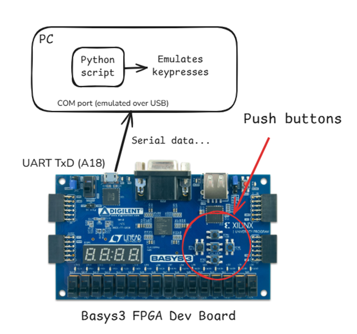

# Push Button Interface using UART

This project implements a system using System Verilog that interfaces push buttons on an FPGA development board to emulate PC arrow key functionality using serial communication (UART). Each push button corresponds to one of the four arrow keys (Up, Down, Left, Right) on a standard keyboard.

Tested on a Digilent Basys 3 FPGA Dev board running on a Xilinx Artix-7 FPGA. Synthesized and implemented with Xilinx Vivado. Constraints provided are specific to the Basys 3.

> **DISCLAIMER**: This was built as a mini-project for class. As such, the code and design may not be fully optimized for all use cases.

## Block diagram

## License

This project is licensed under the MIT License.